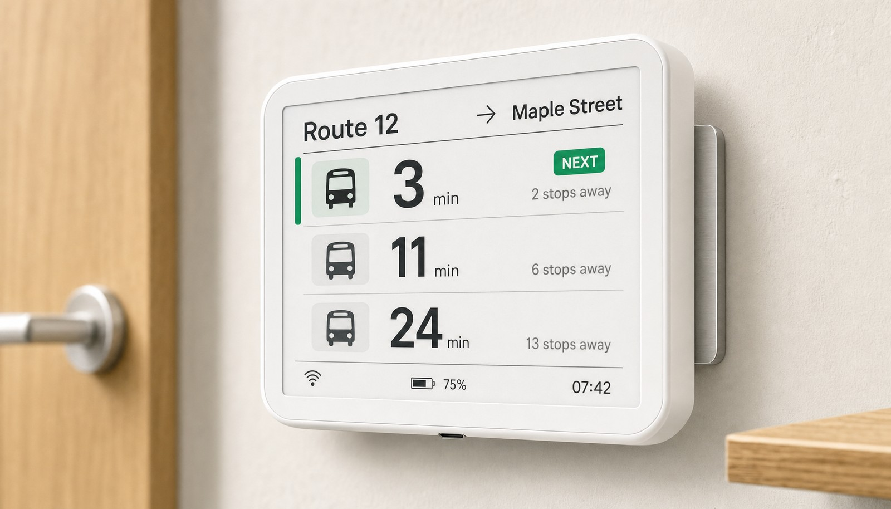

# BusArrivalBoard

<div align="center">
  
</div>

<br>

[](https://opensource.org/licenses/MIT)
[](https://www.python.org/downloads/)

**实时公交到站显示系统** — 通用、可配置的公交到站信息解决方案

[English](./README_EN.md) | 简体中文

---

## 📖 项目简介

BusArrivalBoard 是一个开源的实时公交到站信息显示系统，支持：

- ✅ **Python SDK** — 快速集成到任何 Python 项目
- ✅ **命令行工具** — 终端实时监控公交到站
- ✅ **多城市支持** — 覆盖全国 480+ 城市
- ✅ **配置化管理** — YAML 配置文件，支持多站点监控
- ✅ **蓝牙墨水屏** — 主机直推 nRF51/52 电子价签
- ✅ **HTTP 帧服务端** — 服务端渲染画面，供联网设备拉取
- ✅ **ESP32 固件** — WiFi 自联网、深度睡眠、OTA 升级（已编译通过，待硬件实测）

### 核心特性

| 特性 | 说明 |
|------|------|
| **实时数据** | 基于车来了 API，GPS 实时定位，秒级更新 |
| **完整信息** | 车辆位置、剩余站数、预计到达时间、拥挤度 |
| **环线支持** | 正确处理环线公交的站点计算逻辑 |
| **零依赖认证** | 无需账号/API Key，开箱即用 |
| **服务端渲染** | 排版/中文字库/抖动全在 Python 侧，改布局不用重刷固件 |
| **ETag 省电** | 画面未变返回 304，设备跳过刷屏，是电池续航的核心机制 |
| **两套硬件路线** | 蓝牙价签（主机常开，成本 ¥5）/ ESP32 自联网（独立运行，¥50-70）|
| **OTA + 自动回滚** | 刷坏了设备自己退回上一版，不用从墙上拆下来 |

---

## 🚀 快速开始

### 安装

```bash
# 克隆仓库
git clone https://github.com/Garfield-Wuu/BusArrivalBoard.git
cd BusArrivalBoard

# 安装依赖
pip install -r requirements.txt

# 或安装为库
pip install -e .
```

### 5分钟上手

```bash
# 查询深圳 M592 路公交实时状态
python -m bus_arrival_board.cli query \
  --city "深圳" \
  --line "M592" \
  --station "安翼嘉寓"
```

**输出示例：**
```
查询时间: 2026-08-17 15:01:16
线路: M592  站点: 安翼嘉寓 (第17/26站, 环线)
----------------------------------------------------------
🚌 1. 粤B03745D  在第2站 | 还差15站 | 距离12086m
      约 35分钟 到站 (预计 15:36) | 不拥挤
🚌 2. 粤B05981D  在第7站 | 还差10站 | 距离7549m
      约 21分钟 到站 (预计 15:21) | 不拥挤
🚌 3. 粤B06857D  在第14站 | 还差3站 | 距离2200m
      约 7分钟 到站 (预计 15:07) | 不拥挤
```

---

## 📦 项目结构

```
BusArrivalBoard/
├── chelaile_sdk/          # 核心 SDK
│   ├── client.py          # API 客户端
│   ├── crypto.py          # 加密/签名
│   ├── models.py          # 数据模型
│   └── exceptions.py      # 异常定义
├── bus_arrival_board/     # 应用层
│   ├── cli.py             # 命令行工具
│   ├── config.py          # 配置管理
│   ├── monitor.py         # 实时监控
│   └── server.py          # HTTP 帧服务端（GET /api/epd/frame.bin）
├── firmware/              # ESP32 固件（ESP-IDF）
│   ├── components/        # 四个核心组件
│   │   ├── epd_driver/    #   墨水屏 SPI 驱动（UC8176）
│   │   ├── http_frame_client/ #   HTTP 拉帧 + ETag 缓存
│   │   ├── wifi_provisioning/ #   SmartConfig 配网
│   │   ├── power_management/  #   深度睡眠 + 电池监测
│   │   └── ota_update/    #   OTA 升级 + 自动回滚
│   ├── main/              # 主程序（WiFi→拉帧→刷屏→睡眠循环）
│   └── partitions.csv     # 双分区表（ota_0 + ota_1）
├── examples/              # 使用示例
├── tests/                 # 单元测试（90 个，全绿）
├── scripts/               # 工具脚本
│   ├── review.sh          # 代码门禁（12 项检查）
│   └── activate_idf.sh    # ESP-IDF 环境激活
├── config/                # 配置文件示例
└── docs/                  # 文档
    ├── REVIEW.md          # 评审规范
    ├── ROADMAP.md         # 开发路线图
    ├── epd_protocol.md    # 蓝牙墨水屏协议参考
    ├── epd_bluetooth_integration.md  # 蓝牙方案接入指南
    ├── esp32_porting.md   # ESP32 移植说明
    └── hardware_guide.md  # 硬件选型与 BOM
```

---

## 🔧 使用方式

### 1. Python SDK

```python
from chelaile_sdk import ChelaiLeClient

# 创建客户端
client = ChelaiLeClient()

# 搜索线路
lines = client.search_line(city_id="014", keyword="M592")

# 获取实时到站信息
buses = client.get_realtime_buses(
    city_id="014",
    line_id=lines[0]["lineId"],
    station_id="0755-15924",
    target_order=17
)

for bus in buses:
    print(f"🚌 {bus['busId']}: {bus['eta']['travelTime']}秒后到站")
```

### 2. 命令行工具

```bash
# 实时监控（每60秒刷新）
python -m bus_arrival_board.cli monitor \
  --config config/shenzhen_m592.yaml

# 导出 JSON
python -m bus_arrival_board.cli query \
  --city "深圳" --line "M592" --station "安翼嘉寓" \
  --format json > output.json
```

### 3. 配置文件

`config/shenzhen_m592.yaml`:
```yaml
city: "深圳"
line: "M592"
station: "安翼嘉寓"

refresh_interval: 60  # 秒
display:
  max_buses: 3        # 显示前3辆车
  show_crowd: true    # 显示拥挤度
```

---

## 🎯 应用场景

- **个人桌面监控** — 出门前查看公交到站时间
- **墨水屏显示器** — ESP32 驱动的低功耗实时显示（硬件方案开发中）
- **智能家居集成** — Home Assistant / Node-RED
- **数据分析** — 公交准点率统计、客流分析

---

## 📡 硬件方案

### 路线 1: 蓝牙电子价签（¥5/片，主机直推）
- nRF51/52 芯片电子价签（闲鱼拆机货）
- 主机蓝牙推送位图
- 详见 [蓝牙墨水屏接入指南](docs/epd_bluetooth_integration.md) 与 [EPD 协议参考](docs/epd_protocol.md)

### 路线 2: ESP32 自联网墨水屏（已编译通过，待硬件实测）

**固件状态：** ✅ 编译通过（926KB），双分区 OTA，51% 余量

**推荐硬件：**
- ESP32-S3 开发板（任意型号，需 >= 4MB Flash）
- UC8176 4.2" 黑白墨水屏（400×300，微雪或 GDEW042T2）
- 18650 锂电 + 保护板（可选）
- 分压电阻（100kΩ × 2，用于电池监测）

**已实现功能：**
- ✅ SmartConfig 配网（微信扫码下发凭据，存 NVS 深度睡眠不丢）
- ✅ HTTP 拉帧 + ETag 缓存（304 时跳过刷屏，核心省电机制）
- ✅ UC8176 SPI 驱动（4 秒全刷，深度睡眠 < 1µA）
- ✅ 深度睡眠 + RTC 定时唤醒（< 20µA，5 分钟一次）
- ✅ 夜间跳过模式（23:00-06:00 不刷新）
- ✅ 电池电压监测（ADC 读取，低电量延长睡眠间隔）
- ✅ OTA 双分区升级 + 自动回滚（刷坏了自己退回上一版）

**待验证：**
- ⏳ 真实硬件接线与刷屏（驱动时序、位图极性、BUSY 轮询）
- ⏳ 电池续航实测（理论 3-6 个月，取决于刷新间隔）
- ⏳ SPI 时序兼容性（不同屏厂的 UC8176 参数可能有差异）

**成本估算：** ¥50-70（开发板 ¥30 + 屏 ¥25 + 电池 ¥10）

**烧录方法：**
```bash
cd firmware
source ../scripts/activate_idf.sh
idf.py menuconfig  # 配置 WiFi SSID/Password（可选，首次留空用 SmartConfig）
idf.py -p /dev/ttyUSB0 flash monitor
```

**首次上电：**
1. 无可用凭据时自动进 SmartConfig 配网
2. 用微信小程序"EspTouch"或 App 下发 WiFi 密码
3. 连接成功后每 5 分钟唤醒一次拉帧刷屏
4. 每 24 小时检查一次 OTA 更新

详见 [固件 README](firmware/README.md) 和 [开发路线图](docs/ROADMAP.md)

---

## 🧪 开发

### 运行测试

```bash
pytest tests/ -v
```

### 代码格式化

```bash
black .
isort .
```

### 类型检查

```bash
mypy chelaile_sdk/ bus_arrival_board/
```

---

## 📚 文档

- [API 参考](docs/api_reference.md)
- [配置指南](docs/configuration.md)
- [ESP32 移植指南](docs/esp32_porting.md)
- [硬件 BOM](docs/hardware_bom.md)

---

## 🤝 贡献

欢迎贡献代码、文档、硬件设计！

1. Fork 本仓库
2. 创建特性分支 (`git checkout -b feature/amazing-feature`)
3. 提交改动 (`git commit -m 'Add amazing feature'`)
4. 推送到分支 (`git push origin feature/amazing-feature`)
5. 提交 Pull Request

详见 [贡献指南](CONTRIBUTING.md)

---

## 📄 许可证

本项目采用 MIT 许可证 - 详见 [LICENSE](LICENSE) 文件

---

## 🙏 致谢

- 数据源：车来了（[chelaile.net.cn](https://www.chelaile.net.cn/)）
- 逆向参考：[chelaile-mcp](https://github.com/PeanutSplash/chelaile-mcp) by PeanutSplash

---

## ⚠️ 免责声明

本项目**仅供个人学习和研究使用**，不得用于商业目的。使用本项目即表示您同意：

1. 数据来源于第三方服务，作者不对数据准确性负责
2. 请遵守车来了的服务条款，不要滥用 API
3. 建议刷新间隔 ≥ 60 秒，避免对服务器造成压力
4. 作者不对使用本项目造成的任何损失负责

---

## 📬 联系方式

- **Issues**: [GitHub Issues](https://github.com/Garfield-Wuu/BusArrivalBoard/issues)
- **Discussions**: [GitHub Discussions](https://github.com/Garfield-Wuu/BusArrivalBoard/discussions)

---

**⭐ 如果这个项目对你有帮助，请给一个 Star！**
